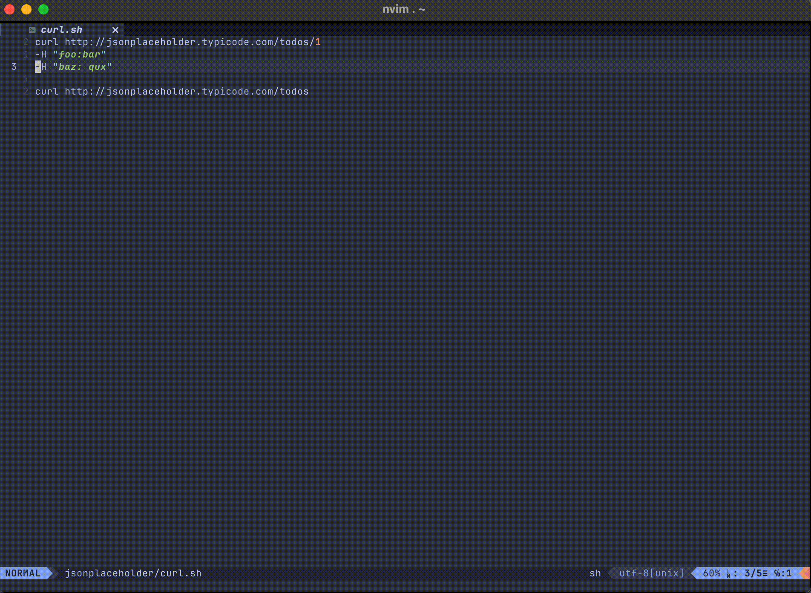

# 💥 Nvim-cURLy (Neovim curly)

Simple plugin to intercommunicate with interactive shell(`curl` more recently) from inside Neovim.


## ✨ Features

- Stored requests & responses history.
- Easy requests modifying for API tests from inside the Neovim.
- Flexible window settings (`vertical`, `horizontal`,`float`).
- Light-weight access to an HTTP endpoints.

## ⚡️ Requirements

- Neovim >= v0.9.0
- Lua >= v2.1

## 📦 Installation

Install the plugin with your preferred package manager:

```lua
-- Packer.

vim.cmd [[packadd packer.nvim]]

return require("packer").startup(function(use)
  -- Packer itself
  use "wbthomason/packer.nvim"
  ...

  -- Nvim-cURLy
  use "kuwerin/nvim-curly"
end)

```


## Functions

### `execute_line`

This method gets the whole line under the cursor to executes it. Works good with `NORMAL` mode.

```lua
nnoremap("<S-r>", ":lua require('nvim-curly').execute_line()<CR>", silent)
```



### `execute_multiline`

This method gets the selected portion and executes it. Works good with `VISUAL AND SELECT` and `VISUAL ONLY` modes.

```lua
xnoremap("<S-r>", ":lua require('nvim-curly').execute_multiline()<CR>", silent)
vnoremap("<S-r>", ":lua require('nvim-curly').execute_multiline()<CR>", silent)
```


### `go_to_history`

(WIP!) Changes the location context of the editor to the Nvim-culry history dir.

### `go_to_workspace_root`

(WIP!) Changes the location context of the editor to the Nvim-culry workspace root.
